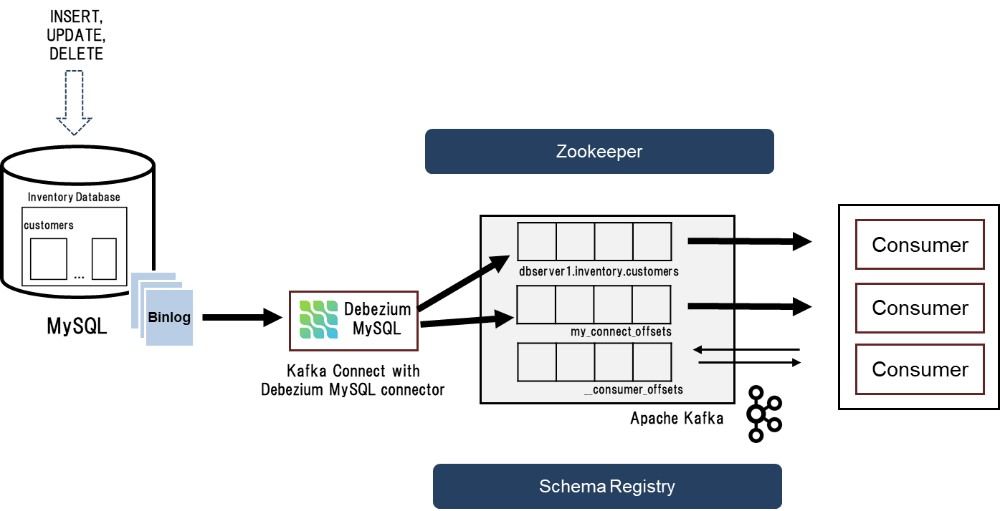

# MySQL Change Data Capture com Debezium
## _Sobre o Projeto_

O projeto permite que os usuários leiam as alterações no banco de dados MySQL usando uma plataforma open source para captura de mudanças em dados (Change Data Capture - CDC). Qualquer operação de nível de linha como 'INSERT', 'UPDATE' ou 'DELETE' em qualquer tabela do banco de dados MySQL pode ser capturada como um evento de mudança com a ajuda de um conector MySQL fornecido pelo Debezium.

Os eventos de mudança são armazenados no Kafka, de onde as aplicações cliente podem ler e usar esses eventos conforme seus casos de uso.

O MySQL possui um binary log (binlog) que registra quaisquer alterações no esquema da tabela ou operações 'INSERT', 'UPDATE' ou 'DELETE' na tabela, na ordem em que são confirmadas (committed).

O MySQL Debezium source connector lê o binlog sequencialmente e produz esses eventos de mudança para os consumidores.



Os seguintes são os passos que seguiremos neste projeto:
- Iniciar containers Docker para Apache Kafka, Zookeeper, Kafka Connect, MySQL e Schema Registry

- Configurar o Debezium MySQL source connector no Kafka Connect

- Utilizar uma ferramenta de linha de comando para interagir com o Kafka broker e verificar os eventos de mudança de dados

- Inserir, atualizar ou deletar dados na tabela Customers do banco de dados Inventory no MySQL

- Capturar eventos de mudança de dados em tempo quase real

## O que é o Debezium?

> Debezium is an open-source distributed platform for change data capture. Start it up, point it at your databases, and your apps can start responding to all of the inserts, updates, and deletes that other apps commit to your databases. Debezium is durable and fast, so your apps can respond quickly and never miss an event, even when things go wrong.

[https://debezium.io](https://debezium.io)

## Rodando o projeto

Para rodar todos os containeres necessários para o projeto:

```sh
$ docker-compose up -d
```

Para inicializar os conectores dentro da pasta connectors:

```sh
$ sh init-connectors.sh
```
